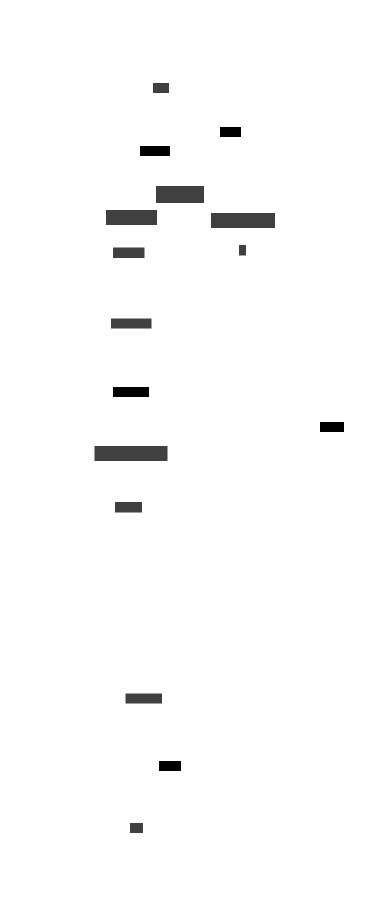

# D2 Extension For Quarto


This [Quarto](https://quarto.org) extension allows you to render
[D2](https://d2lang.com) diagrams directly within your markdown
documents.

Main features:

- Render [D2](https://d2lang.com) diagrams directly within your
  [Quarto](https://quarto.org) markdown documents.
- Control the appearance and layout of your diagrams using global
  settings or code block attributes.
- Tune the width and height of the resulting figures using the “width”
  and “height” arguments.

This extension was inspired by
[`ram02z/d2-filter`](https://github.com/ram02z/d2-filter).

## Installation

### Prerequisites

Ensure that you have [D2](https://d2lang.com/tour/install) installed on
your system.

### Install

Run the following command to add this extension to your current project:

``` bash
quarto add data-intuitive/quarto-d2
```

This will install the extension under the `_extensions` subdirectory. If
you’re using version control, you will want to check in this directory.

## Examples

D2 can be used for simple diagrams.


And for more complex diagrams.

<div>

``` d2
logs: {
  shape: page
  style.multiple: true
}
user: User {shape: person}
network: Network {
  tower: Cell Tower {
    satellites: {
      shape: stored_data
      style.multiple: true
    }

    satellites -> transmitter
    satellites -> transmitter
    satellites -> transmitter
    transmitter
  }
  processor: Data Processor {
    storage: Storage {
      shape: cylinder
      style.multiple: true
    }
  }
  portal: Online Portal {
    UI
  }

  tower.transmitter -> processor: phone logs
}
server: API Server

user -> network.tower: Make call
network.processor -> server
network.processor -> server
network.processor -> server

server -> logs
server -> logs
server -> logs: persist

server -> network.portal.UI: display
user -> network.portal.UI: access {
  style.stroke-dash: 3
}
```



</div>

The enclosing curly brakets are optional if you are only using document
level options. Quarto block-level options, e.g. `#|`, are not currently
supported.


## Attributes

You can specify additional attributes to control the appearance and
layout of the diagram and document:

- `theme`: Specifies the theme of the diagram. Default is
  `"NeutralDefault"`. Options are `"NeutralDefault"`, `"NeutralGrey"`,
  `"FlagshipTerrastruct"`, `"DarkFlagshipTerrastruct"`,
  `"CoolClassics"`, `"MixedBerryBlue"`, `"GrapeSoda"`, `"Aubergine"`,
  `"ColorblindClear"`, `"VanillaNitroCola"`, `"ShirelyTemple"`,
  `"EarthTones"`, `"EvergladeGreen"`, `"ButteredToast"`, `"DarkMauve"`,
  `"Terminal"`, `"TerminalGrayscale"`, and `"Origami"`.
- `layout`: Specifies the layout algorithm to use. Default is `"elk"`.
  Options are `"dagre"`, `"elk"`, `"tala"`. layout is not case sensitive
  so `"ELK"` or `"TALA"` are also supported.
- `format`: Specifies the format of the output image. Default is `svg`.
  Option are `"svg"`, `"png"`, `"pdf"`, `"gif"`.
- `sketch`: Whether to use a “sketch” style for the diagram. Default is
  `false`.
- `pad`: Amount of padding around the diagram in pixels. Default is
  `100`.
- `caption`: Caption to add to the diagram.
- `width`: Width of the output image. Default is `100%`. Examples are
  `"100px"`, `"50%"`, `"3cm"`.
- `height`: Height of the output image. Default is `auto`. Examples are
  `"100px"`, `"50%"`, `"3cm"`.
- `echo`: Whether to echo the original diagram code in the output.
  Default is `false`.

You can also replace the contents of the block with an external D2 file
by using the `file` parameter. `file` must be an existing file ending in
a “d2” or “txt” file extension. Other parameters related to rendering
and embedding diagrams include:

- `folder`: Folder where the generated diagram will be saved. If not
  provided, the image will be embedded inline in the document (HTML
  only).
- `filename`: Name of the output file.
- `embed_mode`: How to embed the diagram in the output. Default is
  `"inline"` for HTML output and `"link"` for other output formats.
  Options are `"inline"`, `"link"`, `"raw"`.

Note that for Typst format output the width and height can’t be supplied
as a percent value.

Here’s an example that uses multiple attributes:

```` markdown
```{.d2 theme="CoolClassics" layout="elk" pad=20 caption="This is a caption" width="50%"}
x -> y -> z
```
````

## Global Options

You can set global options for the d2 filter using the `d2` field in the
document metadata. Here’s an example:

```` markdown
---
title: "D2 Example"
filters:
  - d2
d2:
  layout: elk
  theme: "GrapeSoda"
---

```{.d2 width="40%" echo=true}
x -> y -> z
```
````

## Setting an input file

You can specify an input d2 file. If `echo=true`, the contents of the
file block is replaced by the contents of the file.

```` markdown
```{.d2 file="./diagram.d2"}
```
````

## Setting output folder and file name

You can specify a folder where the generated diagram will be saved using
the `folder` attribute. The `filename` attribute allows you to set a
custom name for the output file.

```` markdown
```{.d2 folder="./images" filename="my_diagram"}
x -> y -> z
```
````

> [!NOTE]
>
> If the `folder` attribute is not provided and the output format is
> HTML, the image will be embedded inline in the document.

## Interactive diagrams

Interactive diagrams will only work when the Quarto output format is
HTML, the figure format is `"svg"`, and the embed mode is `"raw"`.
Example:

```` markdown
---
title: "D2 Example"
format: html
filters:
  - d2
d2:
  format: svg
  embed_mode: raw
---

```{.d2 width="40%"}
x { 
  link: "https://quarto.org"
}
y {
  tooltip: "This is a tooltip"
}
x -> y -> z
```
````
